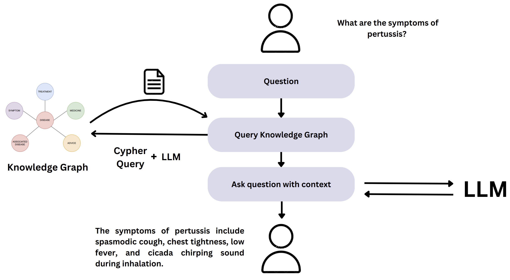
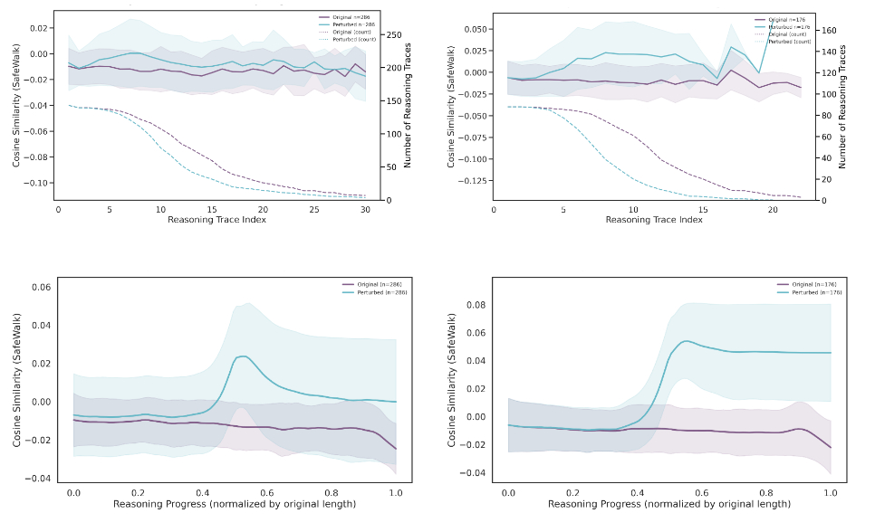

# Publications

## 2025

    

        
    

    

        <h3 class="publication-title">
            <a href="https://arxiv.org/abs/2506.17878" class="publication-link">
                Towards Robust Fact-Checking: A Multi-Agent System with Advanced Evidence Retrieval
            </a>
        </h3>
        
Under Review

        
Tam Trinh, Manh Nguyen, Truong-Son Hy

        
2025

        

            Misinformation
            <!-- <a href="https://arxiv.org/abs/2506.17878" class="tag tag-arxiv">ARXIV</a> -->
            <a href="https://github.com/HySonLab/FactAgent" class="tag tag-github">GITHUB</a>
        

    

    

        
    

    

        <h3 class="publication-title">
            <a href="https://dl.acm.org/doi/10.1145/3744740" class="publication-link">
                VietMedKG: Knowledge Graph and Benchmark for Traditional Vietnamese Medicine
            </a>
        </h3>
        
ACM Transactions on Asian and Low-Resource Language Information Processing

        
Tam Trinh, Anh Dao, Thi Hong Nhung Hy, Truong-Son Hy

        
2025

        

            Knowledge Graph
            NLP
            Traditional Medicine
            <!-- Uncomment when available -->
            <!-- <a href="https://dl.acm.org/doi/10.1145/3744740" class="tag tag-arxiv">ARXIV</a> -->
            <a href="https://github.com/HySonLab/VietMedKG" class="tag tag-github">GITHUB</a>
        

    

<!-- 

    

        
    

    

        <h3 class="publication-title">
            <a href="https://openreview.net/pdf?id=NJNr5KbW3m" class="publication-link">
                Mapping Faithful Reasoning in Language Models
            </a>
        </h3>
        
NeurIPS 2025 Mech Interp Workshop

        
Jiazheng Li, Andreas Damianou, J Rosser, José Luis Redondo García, Konstantina Palla

        
2025

        

            Mechanistic Interpretability
            <a href="https://openreview.net/pdf?id=NJNr5KbW3m" class="tag tag-arxiv">ARXIV</a>
        

    

 -->
